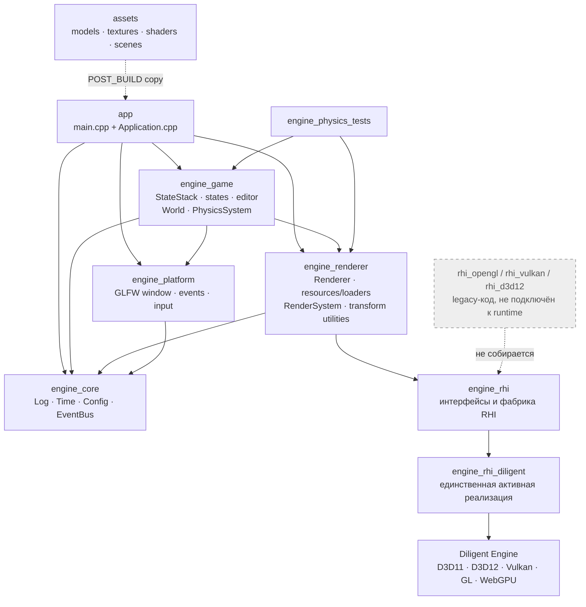
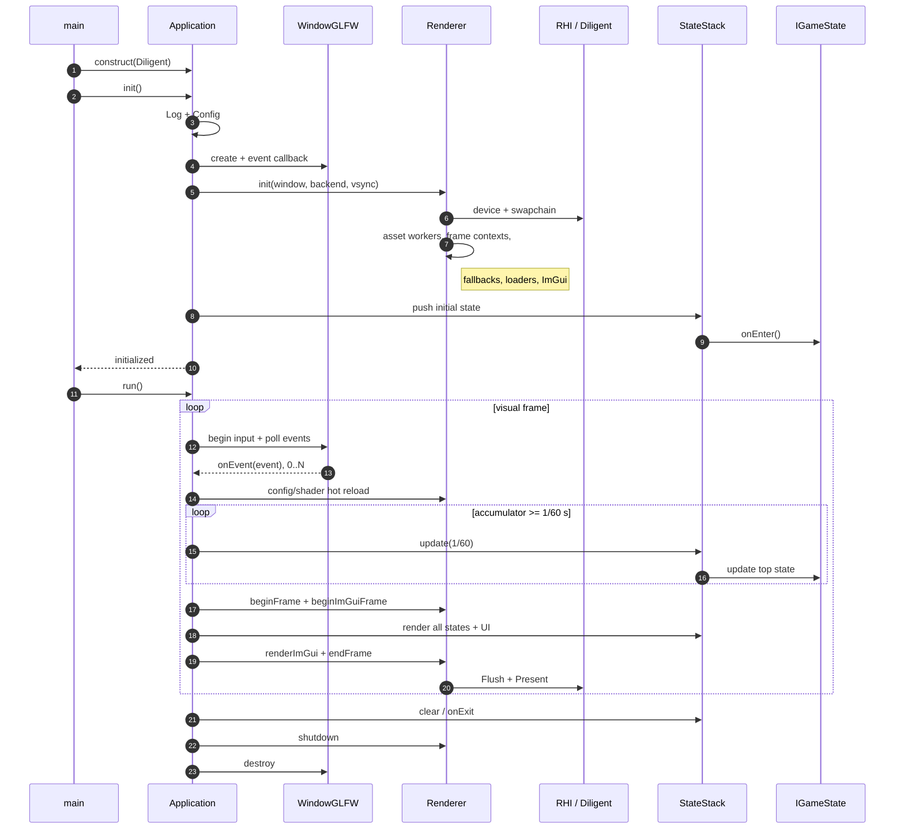
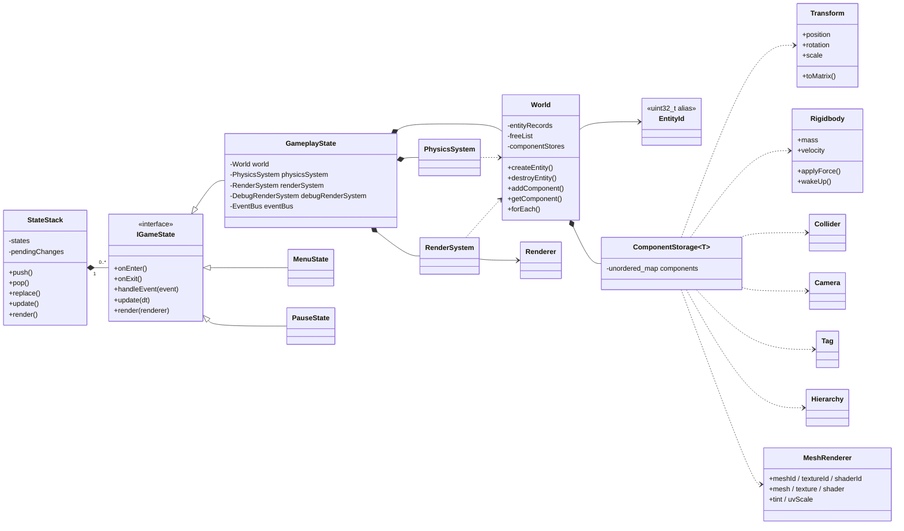
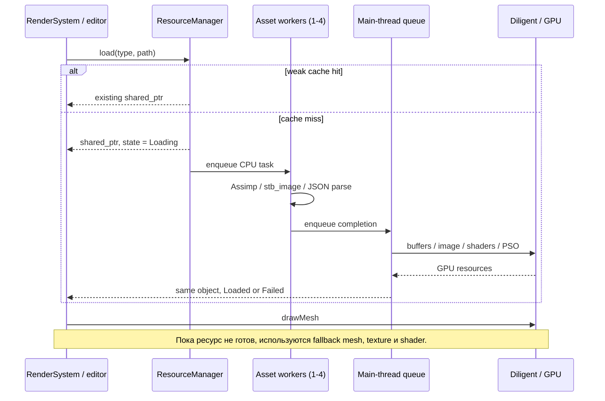

# Архитектура TurboGameEngine

Этот обзор описывает базовую архитектуру до внедрения общей Job System. Его разделы об asset workers, параллельности ECS/physics и составе тестов не отражают текущую реализацию. Актуальный подробный разбор файлов, потока кадра и многопоточности: [путеводитель по коду](project-code-guide.md). Детали ЛР 1: [архитектура Job System](lab1/architecture.md).

## Модули и цели сборки

Папки и CMake-цели совпадают не полностью: `engine/resources` и часть `engine/ecs` собираются в `engine_renderer`; `World`, физика и debug rendering — в `engine_game`; `engine/core/Application.cpp` входит непосредственно в executable `app`. Проверено по `CMakeLists.txt:235-387` и `engine/rhi/RHI.cpp:11-30`.

## Инициализация и главный цикл

Точка входа — `app/main.cpp:5-15`. Главный цикл находится в `engine/core/Application.cpp:290-347`. `StateStack` обновляет верхнее состояние, а рисует стек снизу вверх (`engine/game/StateStack.cpp:24-47`).

## Игровые состояния и ECS

Это гибридная архитектура: наследование используется для крупных состояний приложения, а объекты сцены собираются из компонентов. Компоненты в основном хранят состояние, но не являются строго data-only: у `Transform`, `Rigidbody` и `MeshRenderer` есть вспомогательные методы (`engine/ecs/components.h:21-143`). Автоматического ECS-scheduler нет — порядок систем задаёт `GameplayState`.

## Асинхронные ресурсы, рендеринг и потоки

CPU-чтение и декодирование выполняются асинхронно. GPU upload и shader compilation выполняются на главном потоке при обработке completion-очереди (`engine/renderer/Renderer.cpp:398-489,753-975,1089-1095`). Очереди защищены `mutex` и `condition_variable`; ECS, физика, UI и render submission не распараллелены.

`ResourceManager` хранит loaders, fallback-ресурсы и cache на `weak_ptr`. Реальное время жизни задают `shared_ptr` у клиентов, в частности у `MeshRenderer`; сами `Mesh`, `Texture` и `ShaderProgram` владеют RHI-объектами.

За кадр `RenderSystem` обходит сущности с `Transform + MeshRenderer`, вычисляет world matrix и вызывает `Renderer::drawMesh`. Перед каждым draw обновляются dynamic uniform buffers с MVP, model, UV scale, tint и фиксированным освещением. Render queue, batching, sorting и render graph отсутствуют.

## Материалы и шейдеры

Отдельного типа `Material` нет. Его упрощённую роль выполняют поля `shader + texture + tint + uvScale` в `MeshRenderer`. `ShaderProgram` содержит vertex/fragment modules, pipeline layout и PSO. Shader descriptor — JSON с путями vertex и fragment shader; hot reload отслеживает timestamps и заменяет PSO на главном потоке.

Активный путь использует HLSL через Diligent. Поддерживается одна texture binding. Вызов RHI `pushConstants()` в Diligent-реализации фактически обновляет dynamic uniform buffers через `MAP_FLAG_DISCARD` (`engine/rhi_diligent/DiligentDevice.cpp:327-395`).

## На что ориентировались

Diligent Engine — не только источник вдохновения, а реальный графический backend проекта. `reports/5.tex:139-153` сравнивает возможности редактора с Unity, Unreal Engine и Roblox Studio; подтверждения, что ECS или `StateStack` копируют архитектуру конкретного движка, в репозитории нет.

## Что стоило бы переделать

1. Разделить `GameplayState.cpp` на runtime сцены, editor layer, serialization, undo/redo и picking; разделить `Renderer.cpp` на frame renderer, asset manager, shader manager и ImGui layer.
2. Выделить настоящие CMake-модули `engine_ecs`, `engine_physics`, `engine_resources`, `engine_editor`.
3. Сделать entity handle парой `{index, generation}`: generation увеличивается, но сейчас не входит в `EntityId` и не проверяется.
4. Либо использовать Diligent напрямую, либо устранить Diligent-зависимости из `Renderer` и реализовать полноценный backend-neutral RHI.
5. Ввести `Material` / `MaterialInstance` и shader metadata/reflection вместо определения vertex layout по тексту HLSL и текстурности по имени файла.
6. Коалесцировать одинаковые запросы ресурсов, ограничить GPU-upload budget на кадр и добавить тесты resource concurrency и RHI lifecycle.

Важно: два `FrameContext` не означают настоящие два frames-in-flight. В текущем Diligent-адаптере semaphore пуст, а fence не ждёт GPU (`engine/rhi_diligent/DiligentDevice.cpp:189-209,780-796`).
