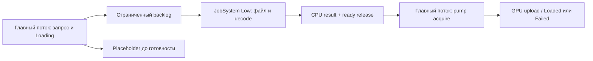

# ЛР 1: архитектура и границы параллелизма

Выбрана задача №2 из каталога: **распараллеливание внутри существующей ECS-системы — подготовка мировых матриц для рендера**. Она использует реальный путь `computeWorldMatrix`, поддерживает иерархии и останется полезной после подключения физического middleware. Интеграция тел и построение физических proxy сохранены как дополнительные потребители, но не заменяют обязательную async-загрузку.

## Один scheduler на движок

`Application` владеет `core::JobSystem`, передаёт его в `Renderer` и через `StateStack` в игровые системы. Обёртка интегрирует enkiTS: фиксированные workers, work stealing, три приоритета, диапазонные задачи. Это вариант с готовой библиотекой из ТЗ; собственная lock-free очередь или fibers не заявляются.

Публичный API: `dispatch`, `dispatchAfter`, `parallelFor`, `wait`, `isComplete`, `waitAll`, `shutdown`. По умолчанию создаётся до четырёх worker-потоков, главный поток может помогать с задачами при ожидании. `Normal`-ожидание не подхватывает посторонний `Low`-IO. Выполняющийся decoder не вытесняется: приоритет влияет на выбор следующей задачи, а не прерывает текущую.

`dispatchAfter` хранит зависимости и ставит continuation после завершения тел предшественников. Handle удерживает состояние задачи; `wait` распространяет исключения. Нельзя передавать handle другого scheduler; вызовы разрешены создавшему scheduler потоку и его задачам. Drain/shutdown — только на основном потоке, вне выполняемой задачи. Подробности: [JobSystem.h](../../engine/core/JobSystem.h), [JobSystem.cpp](../../engine/core/JobSystem.cpp).

## Async loading L1

Устаревшие `m_assetWorkers`, mutex-очередь фоновых задач и отдельный condition variable удалены из `Renderer`. Текстуры проходят настоящий `stbi_load`, модели — `Assimp::Importer::ReadFile` через общий scheduler. Workers не вызывают GPU API и не меняют ECS/ресурс, используемый рендером: они собирают локальные данные и возвращают callback финализации.

`AsyncLoadQueue` заранее создаёт completion на главном потоке. Worker записывает результат/`exception_ptr`, затем публикует `ready` с release. Pump проверяет его с acquire: данные видимы целиком. Очередь и GPU-объекты принадлежат главному потоку. После этого worker не меняет результат. Ссылка на Renderer в GPU-callback остаётся неисполняемой до pump.

Одновременно запущено или ожидает GPU не больше `min(2 × workers, 16)` ресурсов. Остальные запросы — backlog, без thread-per-resource. Это ограничение по числу ресурсов, **не по байтам**. Оно также не даёт перегрузить task pipe enkiTS, при переполнении которого постановка могла бы выполнить работу на вызывающем потоке.

Pump вызывается один раз за кадр в `Renderer::beginFrame`. По умолчанию — максимум один ресурс и 2 мс. Проверка времени проводится между финализациями: отдельный вызов драйвера нельзя прервать, поэтому один upload может превысить 2 мс. В счётчике `uploadedLastFrame` учитываются все попытки финализации, включая ошибки.

До готовности используются placeholder mesh, белая текстура и готовый fallback shader. Ошибка оставляет ресурс в `Failed` с `lastError`; кадр продолжает рисоваться через fallback, автоматической бесконечной повторной загрузки нет. Shader manifest читается в worker; чтение/компиляция самих HLSL/GLSL и создание pipeline остаются на главном потоке. Полностью асинхронная компиляция шейдеров не заявляется.

Shutdown: запрет новых работ → отмена неотправленных запросов → ожидание уже отправленных CPU-задач → отмена неисполненных GPU-финализаций → уничтожение renderer/GPU-ресурсов → shutdown общей job system. Декодер без собственного API отмены не прерывается посреди `ReadFile`; завершение ждёт его возврата. Callback после уничтожения Renderer не остаётся.

Код: [async_load_queue.h](../../engine/resources/async_load_queue.h), [async_load_queue.cpp](../../engine/resources/async_load_queue.cpp), [Renderer.cpp](../../engine/renderer/Renderer.cpp), [loaders.cpp](../../engine/resources/loaders.cpp), [Application.cpp](../../engine/core/Application.cpp).

## ECS: read/write-анализ

| Фаза | Читает | Изменяет | Поток / граница |
|---|---|---|---|
| Update | Игровое состояние, компоненты | Transform, Hierarchy, состав World | До render jobs |
| `Render Gather` | Видимость, resource ID | Кэшированные ссылки MeshRenderer; массив entity ID | Главный |
| `Render Prepare Transforms` | `const World`: Transform и цепочки Hierarchy; неизменяемый список ID | Только собственный диапазон `matrices[begin:end)` | Workers + главный; join до выхода |
| `Render Submit` | Готовые матрицы и ресурсы | GPU command buffer | Главный, после join |

Snapshot содержит **ID сущностей**, а не копию всех компонентов. Поэтому `const World` должен оставаться структурно и логически неизменным до завершения batch: нельзя добавлять/удалять компоненты, менять Transform/Hierarchy или вызвать rehash. Эта гарантия обеспечена фазами вызовов движка, а не универсальным runtime-анализатором read/write-конфликтов.

Для 1024+ видимых объектов запускается `parallelFor` с grain 256; меньшие сцены выполняются последовательно. Демо содержит 4096 render-объектов, root и группы строк. CPU выполняет существующий расчёт мировых матриц каждого кадра; искусственных задержек или повторений вычислений в замеряемом коде нет. Draw calls и lazy resource requests остаются на главном потоке.

Код: [render_system.cpp](../../engine/ecs/render_system.cpp), [transform_batch.cpp](../../engine/ecs/transform_batch.cpp), [transform_utils.cpp](../../engine/ecs/transform_utils.cpp). Тесты сравнивают 4096 матриц, иерархии и прямой последовательный эталон: [TransformBatchTests.cpp](../../tests/TransformBatchTests.cpp).

## Готовность D3D12 к большой сцене

Живой прогон обнаружил недостаточную ёмкость динамической GPU descriptor heap: стандартные 8192 дескриптора Diligent не покрывали сцену с 4096 draw-объектами. Дескрипторы CBV/SRV/UAV расходуются при подготовке draw и освобождаются после завершения GPU-работы, поэтому нужно учитывать несколько кадров в полёте.

В [DiligentDevice.cpp](../../engine/rhi_diligent/DiligentDevice.cpp) `GPUDescriptorHeapDynamicSize[0]` увеличен до 262144 с запасом для поддерживаемого размера сцены. После исправления журналы [ECS before](../../reports/lab1/release-verified/ecs-before-03/app.stdout.log) и [ECS after](../../reports/lab1/release-verified/ecs-after-03/app.stdout.log) показывают одинаковый пик **8704/262144**. Это исправление ёмкости и стабильности рендера, а не ускорение job system. Оба A/B-режима используют одну настройку heap и один бинарник.

Первичная серия `reports/lab1/release-final` завершилась с ошибкой доступа и сохранена для диагностики. Итоговая серия `reports/lab1/release-verified` содержит 15 завершённых запусков; диапазоны и N=3 на каждый режим проверены. [Результаты и ограничения](results.md).

## Что доказывают сравнения

Исходная версия уже имела собственный asset-пул на четыре потока и неограниченный drain. Поэтому `loading/before` — **контролируемый синхронный режим нового кода**, показывающий цену IO/декодирования в кадре, а не утверждение, что исходный движок был синхронным. `after` включает общий scheduler и ограниченный pump. `legacy-pump` оставляет новый scheduler, но снимает практический лимит pump: это отдельный эксперимент, не старый бинарник.

В ECS сравнивается один и тот же batch/сцена, `TGE_JOBS=0/1`. Этот флаг отключает параллельные ECS-вызовы, но не уничтожает общий scheduler и не меняет async-загрузку. Итоговый frame time и время целевой зоны считаются отдельно. Ускорение зоны не означает такое же ускорение всего кадра: GPU submit и прочие последовательные фазы остаются.

Процедура: [tools/lab1/README.md](../../tools/lab1/README.md). Фактические [результаты](results.md) подтверждаются [полной таблицей](../../reports/lab1/release-verified/measurements.md), исходными CSV и `.tracy` всех прогонов.
